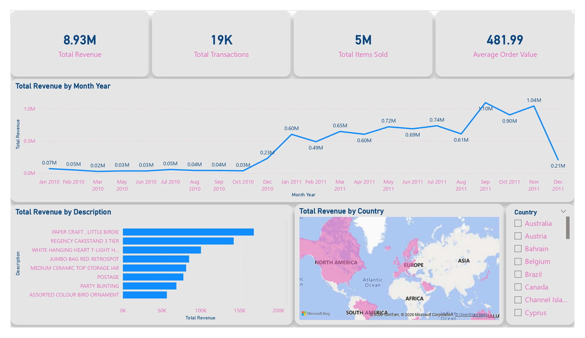
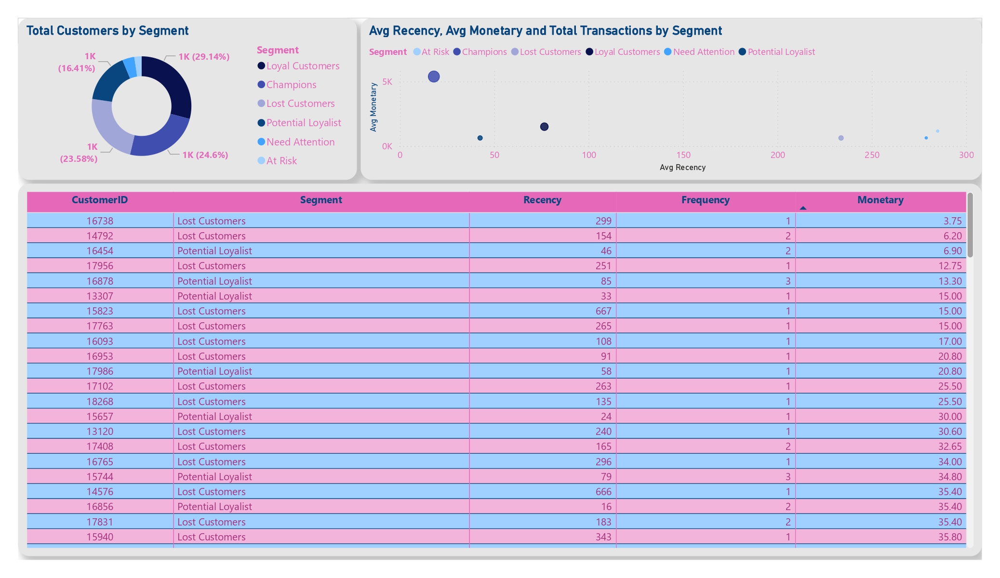
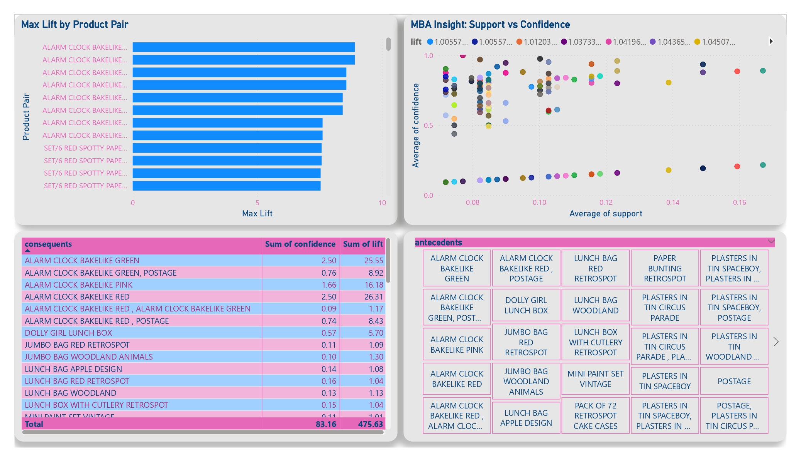

# 🛒 Online Retail Data Pipeline & Business Analytics

## 🔍 Project Overview
This project builds an end-to-end data pipeline to transform large-scale retail transaction data into actionable business insights.
- Processed and cleaned 500,000+ transaction records, including handling returns and missing values  
- Built an automated ETL pipeline using Python and PostgreSQL  
- Performed customer segmentation using RFM (Recency, Frequency, Monetary) analysis  
- Applied Market Basket Analysis to identify product associations  
- Developed an interactive Power BI dashboard to monitor sales performance and customer behavior  
---
## 🛠️ Tech Stack
- **Language:** Python (Pandas, NumPy, Scikit-learn, MLxtend)  
- **Database:** PostgreSQL  
- **ETL Tools:** SQLAlchemy, pg8000  
- **Visualization:** Power BI  
---
## 📊 Key Insights
- **Seasonality Trend:** Total revenue reached $8.93M, with peak sales in November 2011 ($1.04M), indicating strong seasonal demand  
- **Customer Segmentation:** Loyal (29.14%) and Champion (24.6%) customers contribute the majority of revenue  
- **Product Association:** Market Basket Analysis revealed product combinations with lift values up to 8.9x, indicating strong cross-selling opportunities  
---
## 💡 Business Impact
- Supports inventory planning based on seasonal demand patterns  
- Enables targeted marketing through customer segmentation (RFM)  
- Improves cross-selling strategies using product association insights  
---
## 🔄 Data Pipeline
This project implements an end-to-end data workflow:
1. Raw dataset obtained in CSV format from Kaggle  
2. Data loaded into PostgreSQL as a centralized database  
3. Data queried and transformed using SQL  
4. Data processed and analyzed using Python (Pandas)  
5. Results visualized using Power BI dashboard  
---
## 📊 Dashboard Preview
### Executive Sales Overview
Displays key business metrics such as Revenue, Transactions, and Average Order Value (AOV), along with global sales distribution.

### Customer Strategy (RFM)
Visualizes customer segments and behavior patterns using RFM analysis to identify high-value and at-risk customers.

### Product Affinity (Market Basket)
Highlights frequently purchased product combinations to support bundling and cross-selling strategies.

---
## 📂 Dataset
The dataset used in this project is publicly available and sourced from Kaggle.
- **Dataset Name:** Online Retail Dataset  
- **Source:** Kaggle  
- **Link:** [Online Retail Dataset](https://www.kaggle.com/datasets/sowndarya23/online-retail-dataset)  
- **Note:** Due to file size limitations, only a sample of the cleaned dataset is included in this repository.
---
## 📬 Contact
- **LinkedIn:** https://www.linkedin.com/in/alfin-syahrina  
- **Email:** alfinsyahrinafina@gmail.com
